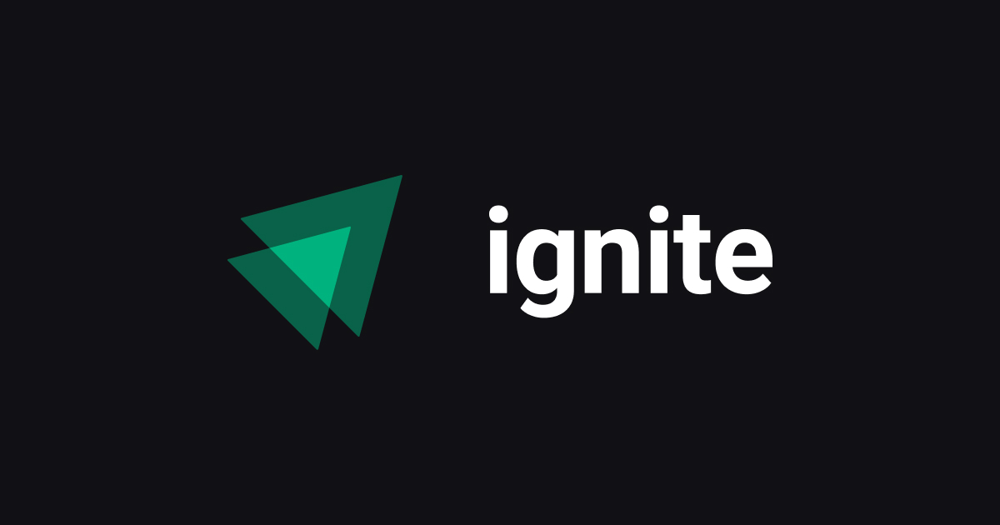

<h1 align="center">
    
</h1>

  <a href="#about">About</a>&nbsp;&nbsp;&nbsp;|&nbsp;&nbsp;&nbsp;  
  <a href="#technologies">Technologies Used</a>&nbsp;&nbsp;&nbsp;|&nbsp;
  <a href="#challenges">Challenges</a>&nbsp;&nbsp;&nbsp;|&nbsp;&nbsp;&nbsp;&nbsp;&nbsp;
  <a href="#license">License</a>

  

  

  

 

## :books: About

Ignite is an online, practical and intensive training. In Ignite the student goes deep into the technology ReactJS and the entire ecosystem around these tool, from zero to deploy, including automated tests, continuous integration, publishing in stores, and all the important libraries and frameworks for who wants to be ready for the challenges of the real world and stand out in the job market.

 

## ⚒️ Technologies Used

 * env
 * Zod
 * Intl
 * CSS3
 * UUID
 * HTML5
 * Immer
 * ReactJS
 * Radix-ui
 * Date-fns
 * Typescript
 * API viacep
 * JSON-server
 * CSS modules
 * Context API
 * LocalStorage
 * API do GitHub
 * React markdown 
 * Phosphor Icons
 * React hook form
 * Styled components

 

## :abacus: Classes projects

- [TimeLine](https://github.com/RuthMaria/ignite-timeline)
- [Timer](https://github.com/RuthMaria/ignite-timer)
- [DT Money](https://github.com/RuthMaria/ignite-DTMoney)

 

## 🎯 Challenges projects

- [Todo List](https://github.com/RuthMaria/ignite-todoList)
- [Coffee Delivery](https://github.com/RuthMaria/ignite-coffeeDelivery)
- [GitHub Blog](https://github.com/RuthMaria/ignite-githubBlog)

 

 

## :memo: License

This project is under the MIT license. See the  file [LICENSE](LICENSE.md) for more details.

---

<h4 align="center">
    Developed with ❤️ by <a href="https://www.linkedin.com/in/ruth-maria-9b256071/" target="_blank">Ruth Maria</a>
</h4>
